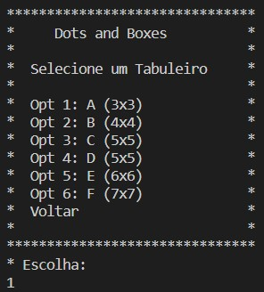
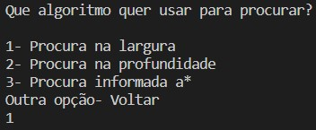
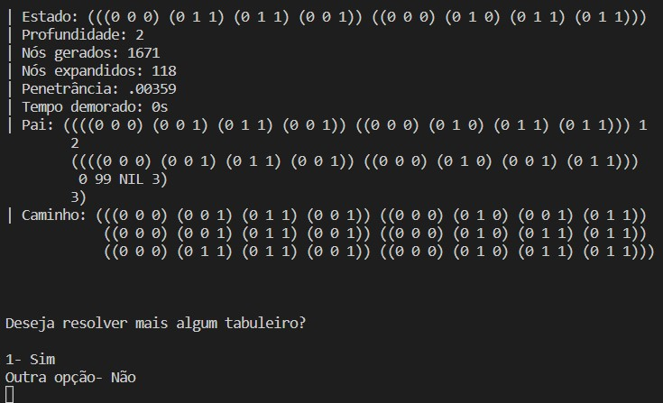

# Manual Do Utilizador  

## Inteligência Artificial - 2022/2023    
### Docente - Joaquim Filipe   
### Alunos:  
- Aurélio Miranda - 202000572   
- Bruno Silva - 202200258   

## Indice  
* Objetivos do programa  
    * Descrição geral de funcionamento  
* Como se usa o programa  
    * Exemplos de utilização  
* Descrição da informação necessária  
* Descrição da informação produzida  
* Limitações do programa  

  

## Objetivos do programa 
> Este programa tem como objetivo resolver um puzzle que consiste num tabuleiro de pontos e arcos, sendo como objetivo do puzzle criar quadrados com os arcos. O tabuleiro pode começar com ou sem arcos e com um número objetivo de arcos pré-definido, o jogador deve criar os quadrados pedidos com o número mínimo de arcos possível.  
> No caso do programa desenvolvido, este usa algoritmos para resolver os tabuleiros de forma automática.  
> Ultimamente este programa foi desenvolvido com o objetivo de ajudar jogadores a resolver estes tabuleiros com mais facilidade.

### Descrição geral de funcionamento  
> Essencialmente são aplicados algoritmos a um tabuleiro para que possam ser analisadas todas as opções possíveis e escolhida a melhor.  
> Quando aplicados ao mesmo tabuleiro diferentes algoritmos é possível observar que dependendo do tabuleiro um algoritmo pode ser melhor que o outro.  

  
  
  

## Como se usa o programa 
> Para a utilização do programa é necessário correr o mesmo num compilador lisp (para este projeto foi utilizado o vscode) e de seguida correr o commando que inicia o programa:
`(start)`  
> Após correr este método irá aparecer um menu que servirá de interface para selecionar as opções desejadas. Para selecionar uma opção é necessário digitar o número correspondente e clicar no enter, pro exemplo, digitar `1` e clicar enter no menu principal fará a transação para o menu da seleção de tabuleiros.  
> No menu de seleção de tabuleiros pode escolher o tabuleiro que deseja resolver recorrendo ao método acima (digitar um número e pressionar enter) e assim será enviado para o menu da seleção de algoritmos.  
> No menu de seleção de algoritmos deverá ter atenção que se selecionar o algoritmo da procura em profundidade (DFS) terá de incluir a profundidade máxima desejada o que poderá impedir o algoritmo de resolver o problema.  
> Após selecionar o algoritmo e clicar na tecla enter este irá resolver o tabuleiro e imprimir todos os detalhes desta resolução.  
> No final a resolução é registada no ficheiro `resultados.dat` caso esta seja encontrada.

## Exemplos de utilização 
> No menu de seleção de tabuleiros selecionamos o tabuleiro A:  
  
> De seguida selecionamos o algoritmo:  
  
> Assim podemos observar o resultado abaixo:  
  
> Finalmente podemos verificar os resultados e escolher resolver outro tabuleiro ou sair do programa.

  

## Descrição da informação necessária  
> Para efetuar a resolução dos tabuleiros é necessário que os mesmos se encontrem no ficheiro `problemas.dat` para que o programa possa ler e postriormente selecionar aquele escolhido pelo utilizador.  
> Para além dos tabuleiros é necessário o input do utilizador para definir as escolhas do mesmo e definir variáveis tais como a profundidade do algoritmo dfs por exemplo.  

## Descrição da informação produzida  
> Após a resolução de um tabuleiro, caso não haja solução, o utilizador será notificado através de uma mensagem na consola, no caso  de haver solução será mostrado na consola toda a informação sobre a resolução do mesmo, incluindo:  
- Estado
- Profundidade
- Nós gerados
- Nós expandidos
- Penetrância
- Tempo demorado  
- Pai do nó solução
- Caminho até á solução
> Adicionalmente quando um tabuleiro é resolvido com sucesso, o resultado do mesmo é guardado no ficheiro `resultados.dat`.

  

## Limitações do programa  
> A maior limitação do programa é não possuir o algoritmo A* funcional, o que limita a escolha de algoritmos apenas para algoritmos não informados.  
> Adicionalmente o tempo de resolução de alguns problemas é extremamente alto devido ao recurso a procuras não informadas, podendo ficar horas sem fornecer uma solução.  
> Finalmente, no que toca á leitura de problemas presentes em ficheiros esta encontra-se incompleta, podendo apenas ler o primeiro algoritmo, contudo, é possível aceder aos restantes algoritmos, não recorrendo á leitura nos ficheiros.    