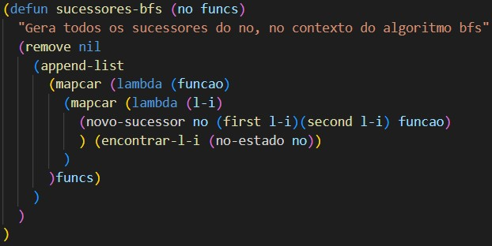

# Manual Técnico

## Inteligência Artificial - 2022/2023    
### Docente - Joaquim Filipe   
### Alunos:  
- Aurélio Miranda - 202000572   
- Bruno Silva - 202200258   

## Indice  
* Algoritmo geral  
* Descrição dos objetos que compõem o projeto  
* Identificação das limitações e opções técnicas  
* Análise critica dos resultados das execuções do programa  
    * Análise comparativa das heuristicas   
* Lista dos requisitos do projeto que não foram implementados  

  

## Algoritmo geral  
> O programa está dividido em 3 ficheiros:  
- `projeto.lisp`  
- `puzzle.lisp`  
- `procura.lisp`  
> O algoritmo começa no ficheiro `projeto.lisp` que consiste na interação com o utilizador e leitura e escrita de ficheiros.  

> Seguidamente passa as escolhas do utilizador para funções no ficheiro `puzzle.lisp`, onde o mesmo estrutura a escolha do utilizador e chama funções de resolução de algoritmos encontradas no ficheiro `procura.lisp`.  

> No ficheiro `procura.lisp`são aplicados os algoritmos ao tabuleiro escolhido e retornado o nó solução do mesmo.

## Descrição dos objetos que compõem o projeto  

> A interação com o utilizador no ficheiro `projeto.lisp` consiste numa série de menus apresentados na consola para que o utilizador possa escolher a opção que deseja e assim utilizar eficazmente a aplicação. A parte de leitura de ficheiros contém a função `ler-ficheiro` que retira toda a informação presente no ficheiro `problemas.dat` e transforma-a numa lista retirando os espaços e as vírgulas:  
  
> No que toca à escrita em ficheiros, é utilizada a função `escrever-ficheiro` que escreve o resultado de um algoritmo efetuado com sucesso no ficheiro `resultados.dat`:  
  

> Para além de estruturar a escolha do utilizador, o ficheiro `puzzle.lisp` possui todas funções de criação e manipulação de um estado do problema bem como funções de criação de nós teste para facilitar a testagem de alguns métodos:  
  
> Adicionalmente, o ficheiro `puzzle.lisp` tem funções especificas para a resolução deste problema, tais como a função `contar-caixas-fechadas` que conta o número de caixas formadas po um conjunto de 4 arcos. Esta função é crucial para a resolução do projeto dado que é necessário saber várias vezes quantos quadrados se encontram em cada estado.  
  

> No caso do ficheiro `procura.lisp`, este contem a implementação dos algoritmos de procura BFS, DFS e A*. Para a resolução destes algoritmos foi escolhido aplicar uma "função sucessores" para cada, por exemplo, a função `sucessores-bfs` que efetua os sucessores de um nó segundo o algoritmos BFS.  
  
> Essencialmente o ficheiro de procura contém a aplicação da prespetiva dos alunos relativamente aos algoritmos.  
  

## Identificação das limitações e opções técnicas  

> No que toca a limitações, estas são bastante evidentes, a maior e mais notável é a falta da implementação do algoritmo A*. Ainda assim foi efetuada uma tentativa, ainda que sem sucesso.  

> Relativamente a limitações de performance temos as limitações na resolução de problemas, nomeadamente na duração de tempo excessivo no que toca á resolução dos problemas c), d), e) e f). Ainda que os algoritmos (BFS e DFS) sejam capazes de resolver, demoram horas a obter um resultado, não sendo assim viável.  

> A leitura de ficheiros está incompleta, sendo que apenas é possível obter o primeiro tabuleiro presente no ficheiro devido a um erro não resolvido.  

> Na medição das métricas de um algoritmo, estas por vezes encontram-se incorretas devido a erros desconhecidos. Ainda nas métricas, o tempo de execução de um algoritmo é executado em segundos o que faz com que resolução de tabuleiros em menos de 1 segundo forneçam o tempo de 0 segundos.  

> Alguns algoritmos não aplicam um comportamento correto em relação a certos problemas.

  
  
  

## Análise critica dos resultados das execuções do programa  

> Seguidamente podemos ver a comparação dos algoritmos BFS e DFS na resolução do tabuleiro a:  

> BFS:   
  
> DFS:  
  
> Como podemos observar, neste caso o algoritmo DFS é mais eficiente dado que a profundidade escolhida foi 2, assim o algoritmo chegou á solução mais rápidamente sem gerar nós desnecessários. Caso a profundidade escolhida tivesse sido 1 o tabuleiro não seria resolvido.  

> BFS:  
  
> DFS:  
  
> Como podemos observar, neste caso o algoritmo BFS devia ser mais eficiente que o algoritmo DFS dado que o algoritmo DFS iria procurar todas as opções possíveis até à profundidade máxima, contudo, como já foi referenciado anteriormente, este comportamento está incorreto. Ainda que disponha a solução correta.  

## Análise comparativa das heuristicas  

> Ainda que o algoritmo A* não tenha sido efetuado, foi desenvolvida uma heurística que possibilita um melhor desempenho do mesmo.  
> A heurística proposta no projeto conta o número de caixas necessárias até chegar ao objetivo, contudo, negligencia as caixas que apenas necessitam de 1 arco colocado para serem fechadas.  
  
> A heurística proposta pelos alunos não só conta as caixas já fechadas como também as caixas que apenas precisam de 1 arco para estarem fechadas. Esta heurística promove a utilização de nós mais direcionados para a criação de novas caixas. Ainda que não esteja perfeita, na teoria, pode gerar melhores resultados que a heurística dada.  

## Lista dos requisitos do projeto que não foram implementados  

- Algoritmo A*  
- Resolução eficiente dos problemas c), d), e) e f)  
- Aplicação de um algoritmo extra (SMA*, IDA* ou RBFS)  
